# Pi-hole

## Overview
Pi-hole is a network level DNS sinkhole that blocks unwanted content before it reaches your device. Its most common use case is to block ads on local networks. This is done through network level filtering via dns queries. While a traditional browser-based ad blocker blocks based on HTTP/HTTPS requests before they leave the browser, Pi-hole intercepts dns queries and filters them based on a set list of domains that you can explicitly configure. Traditional browser-based ad blockers are limited to a specific browser process. They cannot block content if the user is using another browser that isn't using the browser-based ad blocker. However, because Pi-hole operates as a dns server, any device using Pi-hole as a dns server will get content filtering automatically regardless of browser. This extends protection beyond traditional computers entirely. Devices like smart TVs, IoT devices, and mobile apps that have no browser extension support are filtered at the DNS level automatically.
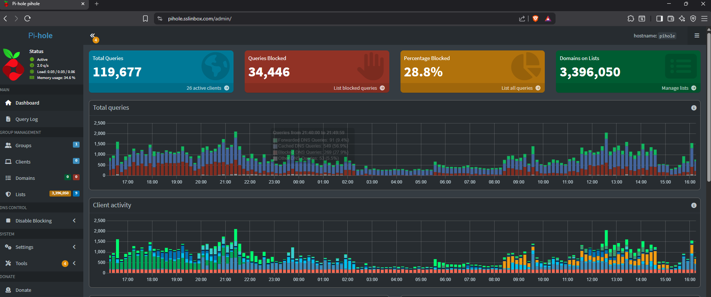 

## Deployment
LXC on Proxmox running Debian 12 with 1 core, 512MB RAM, and 8GB of disk on the ZFS pool. 

I went with an LXC over a VM because Pi-hole doesn't need a full OS to itself. LXC containers share the proxmox host kernel meaning Pi-hole gets its own isolated environment without the overhead of spinning up a second OS instance. For Pi-hole, a service this lightweight, a full VM would be a waste of resources. 

DNS is extremely important in a network because it acts as a phonebook mapping IP addresses to human-readable names. Without DNS hosts wont be able to access websites, send emails, or know where servers like the domain controller would be. Pi-hole runs in its own dedicated container to provide operational stability through isolation from my other services. Isolation from other services and resources prevents resource exhaustion and the chance of Pi-hole breaking.

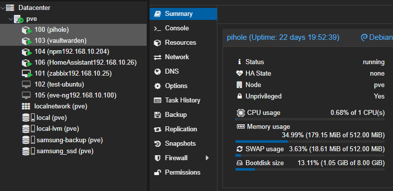 

## cloudflared
cloudflared runs on the same LXC as Pi-hole, listening via 127.0.0.1#5053. It proxies DNS queries from Pi-hole to Cloudflare over HTTPS (port 443) via TLS instead of UDP 53. This was added to provide an extra layer of security.

Upstream resolvers configured:

- 127.0.0.1#5053 = cloudflared, primary
- 1.1.1.1 = Cloudflare direct, fallback
- 1.0.0.1 = Cloudflare secondary, fallback

The plain Cloudflare fallbacks are intentional. This ensures that if cloudflared goes down only encryption fails not DNS functionality. 

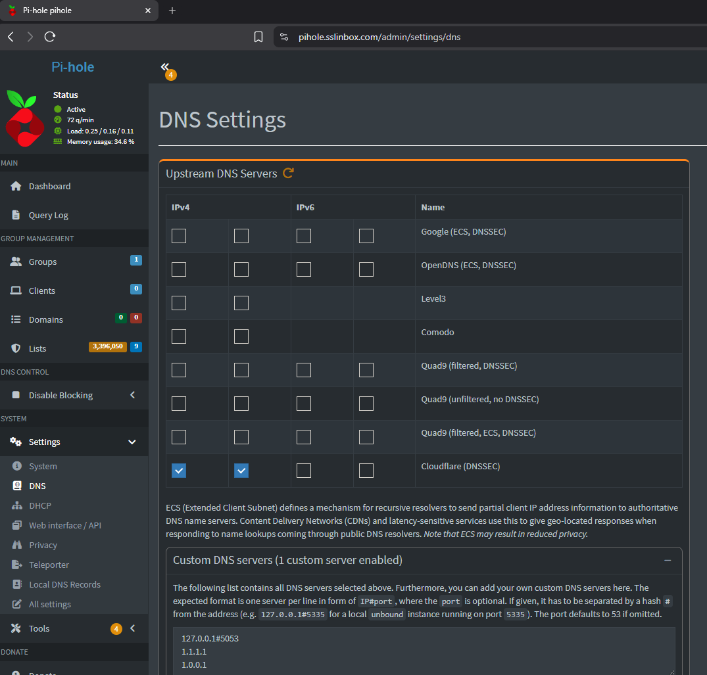 

## DNS Architecture
pfSense hands out Pi-hole's IP via DHCP to every client on all VLANs. Pi-hole handles the filtering while cloudflared handles encryption. Pi-hole receives the query, checks it against the blocklists, and if it passes forwards it to cloudflared which encapsulates it in HTTPS before it leaves my network. 

Validation via Wireshark capture on outbound DNS queries:
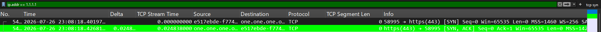 
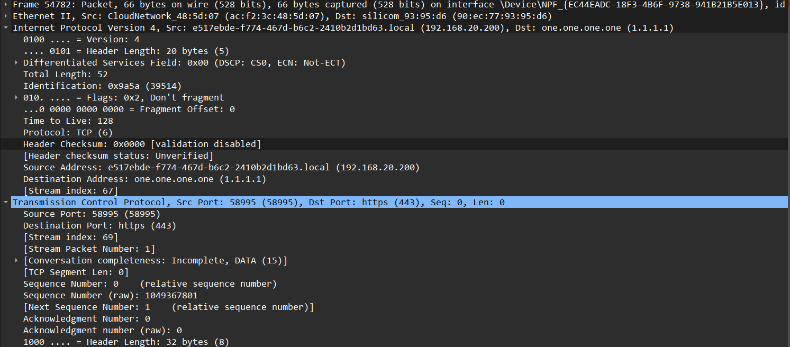 
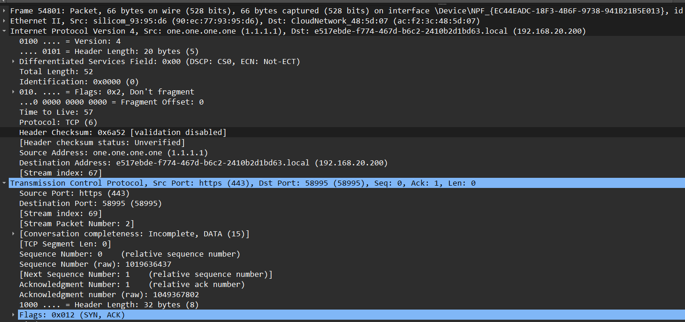 

## Blocklists

Running nine blocklists covering ads, tracking, malware, 
ransomware, fraud, abuse, and content filtering:

| List | Coverage |
|---|---|
| StevenBlack/hosts | Ads and malware (standard baseline list) |
| BlocklistProject ads | Ad domains |
| BlocklistProject tracking | Tracking and telemetry |
| BlocklistProject malware | Malware distribution domains |
| BlocklistProject ransomware | Ransomware C2 and distribution |
| BlocklistProject abuse | Spam and phishing |
| BlocklistProject fraud | Fraud domains |
| Hagezi DNS light | Multi-purpose, balanced for low false positives |
| StevenBlack fakenews-gambling-porn | Extended content filtering |

Validation of Pi-hole's network level filtering:

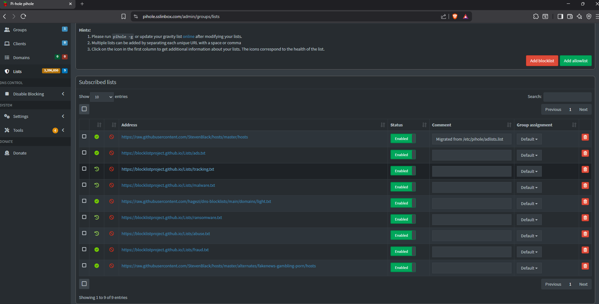 
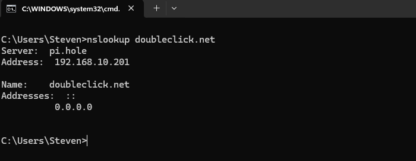 

## Network Stats interpretaion
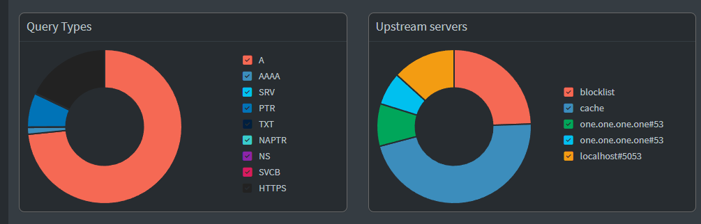 
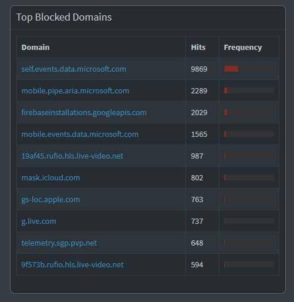 
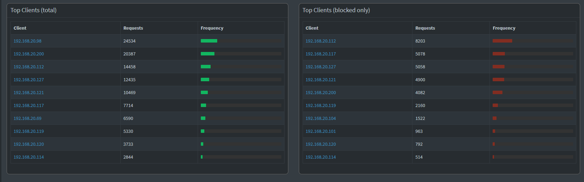 

Over the past 24 hours Pi-hole handled 119,677 DNS queries across 26 active clients, blocking 34,446 queries (28.8% block rate). Roughly 1 in 3 DNS queries are blocked.

Microsoft telemetry alone accounts for the bulk of my blocked traffic with self.events.data.microsoft.com hitting 9,939 blocks and mobile.pipe.aria.microsoft.com at 2,275. Then Firebase, Apple, Xbox Live, and Skype telemetry make up the rest of the top blocked list. None of these are explicitly requested by a user and are most likely background telemetry traffic from applications and devices phoning home. 

On the upstream servers chart, localhost#5053 is visible as one of the upstream destinations confirming cloudflared is actively receiving and encrypting forwarded queries. The majority of traffic is either served from cache or blocked before ever reaching an upstream resolver.

Every client on the network is routing DNS through Pi-hole regardless of device type, confirming pfSense is successfully handing out Pi-hole's IP across all VLANs via DHCP.
